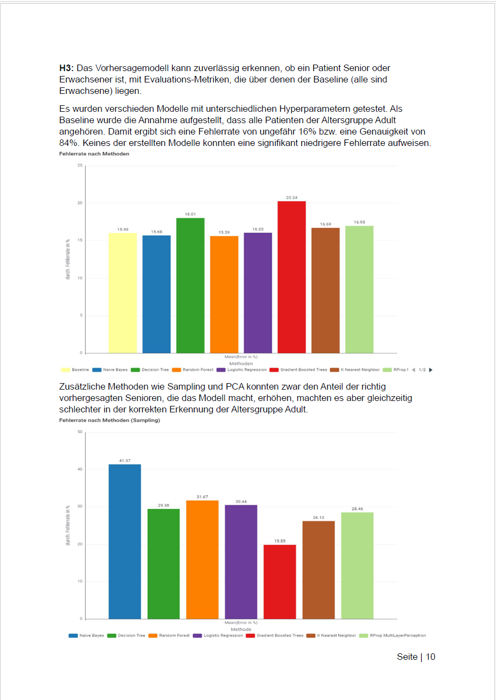
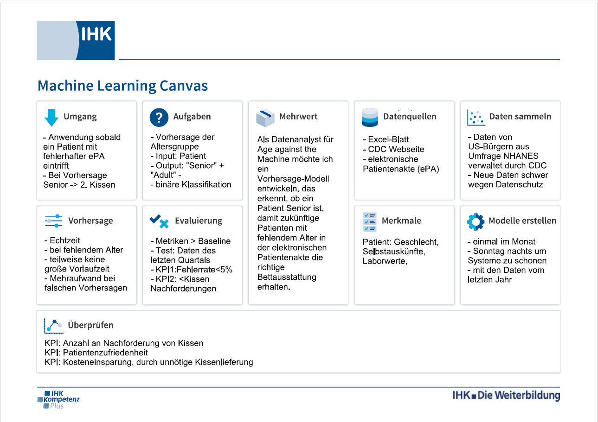
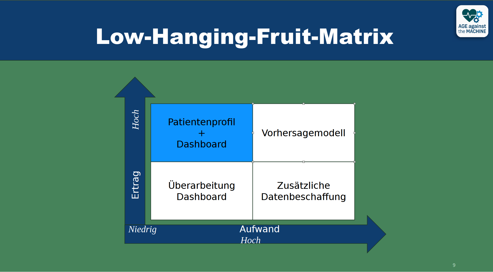
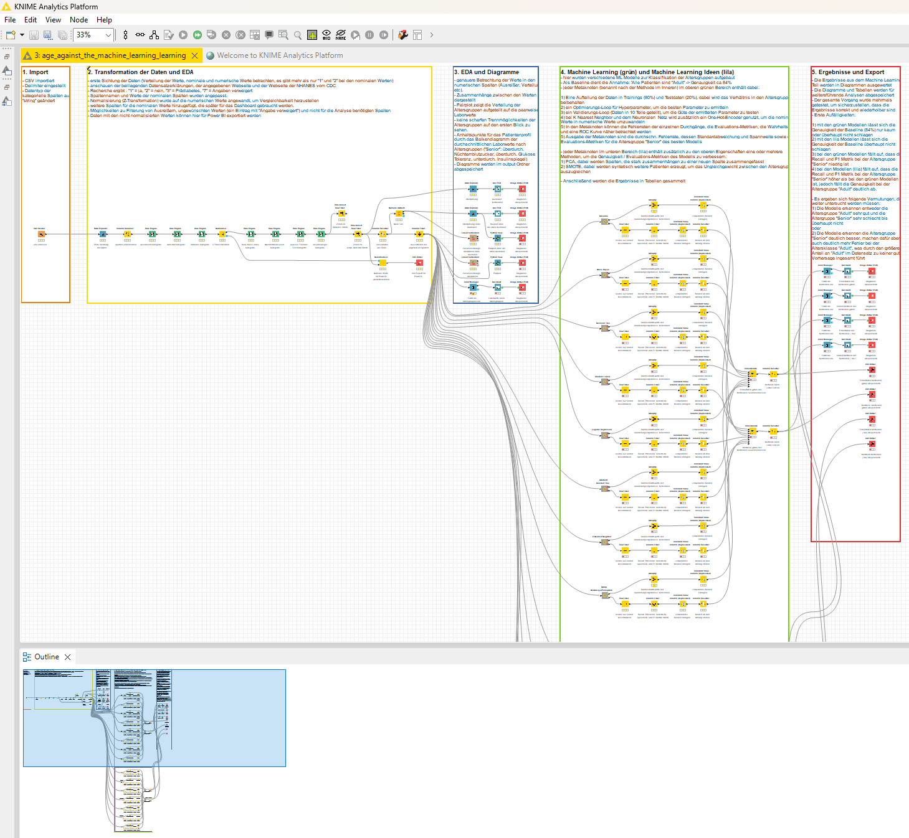
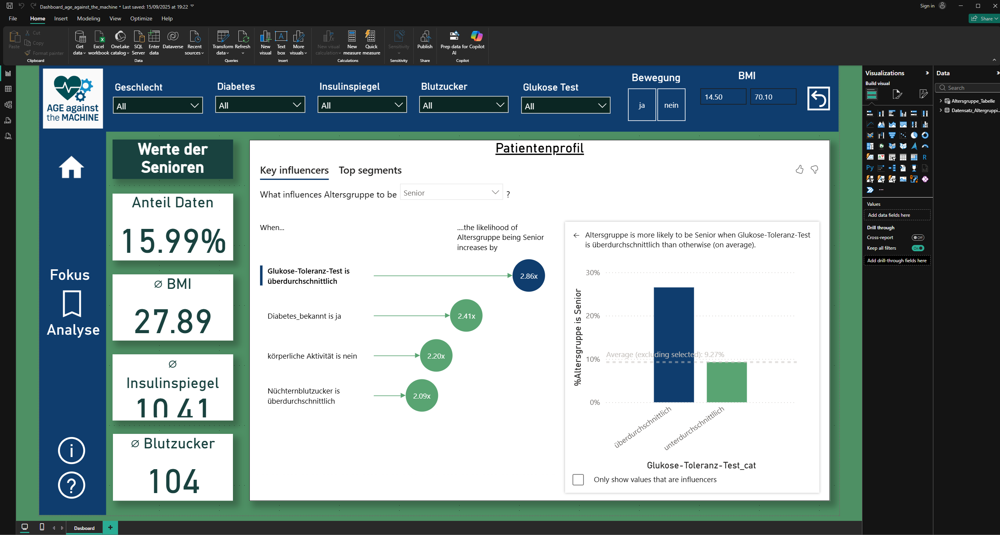

> ⚠️ Dieses Projekt dient ausschließlich zu Lern- und Demonstrationszwecken.


# Praxisprojekt_06_IHK_Pruefung

---

## Projektbeschreibung Age against the Machine Learning

### Ausgangssituation

Das **Kreiskrankenhaus Gronau (Leine)** und die Abteilung **„Age against the Machine“** möchten die Daten der elektronischen Patientenakte besser nutzen, um zukünftige Patientinnen und Patienten besser einordnen zu können.

Ziel ist es, bereits beim Einchecken vorherzusagen, ob eine Person zur Altersgruppe **„Senior“** gehört. Auf Grundlage dieser Vorhersage soll das Krankenhausbett direkt mit einem zweiten Kissen ausgestattet werden können.

Dafür soll ein **Patientenprofil** erstellt werden, das die wichtigsten Einflussfaktoren auf die Zugehörigkeit zu einer Altersgruppe aufzeigt. Dadurch soll die Bettvorbereitung direkt an die Bedürfnisse der jeweiligen Altersgruppe angepasst werden können.

### Verfügbare Daten und ihre Aussage

Der verwendete Datensatz umfasst **2.278 Personen aus den USA** und stammt aus einer nationalen Gesundheits- und Ernährungsumfrage der **Centers for Disease Control and Prevention (CDC)**.

Da die Daten aus einer US-amerikanischen Bevölkerungsgruppe stammen, ist eine direkte Übertragbarkeit auf deutsche Patientinnen und Patienten möglicherweise nur eingeschränkt gegeben.

Der Datensatz enthält unter anderem folgende Merkmale:

- Altersgruppe
- Geschlecht
- Körperliche Aktivität
- Body-Mass-Index (BMI)
- Nüchternblutzucker
- Bekanntes Vorliegen von Diabetes
- Glukose-Toleranz-Test
- Insulinspiegel

Die **Zielvariable** für die Vorhersage ist die Spalte `age_group` mit den Ausprägungen:

- `Adult`
- `Senior`

### Verwendbarkeit und Qualität der Daten

Die vorhandenen Gesundheitsdaten sind überwiegend numerisch. Aufgrund unterschiedlicher Skalen und Einheiten können die Merkmale jedoch nicht ohne vorherige Aufbereitung direkt miteinander verglichen werden.

Darüber hinaus bestehen weitere Einschränkungen hinsichtlich der Datenqualität und Übertragbarkeit.

#### Ungleichgewicht der Altersgruppen und Diabetesfälle

Die Klassenverteilung ist unausgewogen. Erwachsene überwiegen gegenüber Senioren deutlich. Zusätzlich sind weniger als **1 %** der Personen als Diabetiker erfasst.

Dieses Ungleichgewicht kann sich insbesondere auf die Erkennung der Minderheitsklasse auswirken und sollte bei der Bewertung des Machine-Learning-Modells berücksichtigt werden.

#### Standardisierung der Gesundheitswerte

Die unterschiedlichen numerischen Gesundheitswerte müssen standardisiert bzw. skaliert werden, damit die Merkmale für das Machine-Learning-Modell sinnvoll miteinander vergleichbar sind.

#### Entfernen nicht relevanter Werte

Bei der Variable **körperliche Aktivität** kommt einmalig der Wert **„Angabe verweigert“** vor.

Da es sich hierbei um einen einzelnen fehlenden bzw. nicht verwertbaren Wert handelt, kann dieser im Rahmen der Datenbereinigung entfernt oder entsprechend behandelt werden.

---

## Inhalte

- Projektmanagement und Dokumentation inklusive Machine Learning Canvas
- Low-Code Machine Learning in KNIME
- Power BI Dashboard (einseitig, als Simulation im Power BI Dienst)
- PowerPoint-Präsentation der Ergebnisse

## Screenshots

### Dokumentation



### Machine Learning Canvas



### PowerPoint-Präsentation



### KNIME Workflow



### Power BI Dashboard



---

## Technologien

-   Microsoft 365: Word, Excel, PowerPoint
-   Power BI
-   KNIME + Python

---

## Projektstruktur

```text

├── Dashboard_age_against_the_machine.pbix
├── logo (3).png
├── Präsentation_age_against_the_machine.pptx
├── Projektbeschreibung_age_against_the_machine.pdf
├── README.md
├── workflow_age_against_the_machine.knar
├── docs/images
└── Knime/

```

| Ordner / Datei | Beschreibung |
|----------------|-------------|
| `Dashboard_age_against_the_machine.pbix` | Power BI-Dashboard-Datei |
| `logo (3).png` | KI generiertes Logo für "Age against the machine"  |
| `Präsentation_age_against_the_machine.pptx` | PowerPoint-Präsentation der Ergebnisse |
| `Projektbeschreibung_age_against_the_machine.pdf` | Dokumentation und Projektbeschreibung (inkl. Machine Learning Canvas) |
| `workflow_age_against_the_machine.knar` | KNIME-Workflow-Archivdatei |
| `Knime/` | Ordner für KNIME-Daten und Modelle |

---

## Voraussetzungen

-  Microsoft 365
-  Power BI 
-  KNIME
-  Python

---

## Repository klonen

``` bash
git clone https://github.com/Pydatrick/Praxisprojekt_06_IHK_Pruefung.git
cd Praxisprojekt_06_IHK_Pruefung
```

---